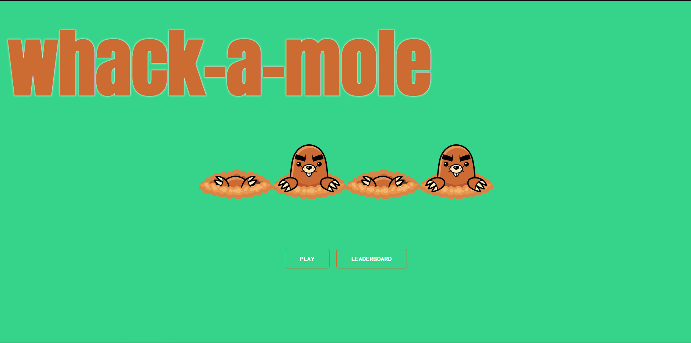
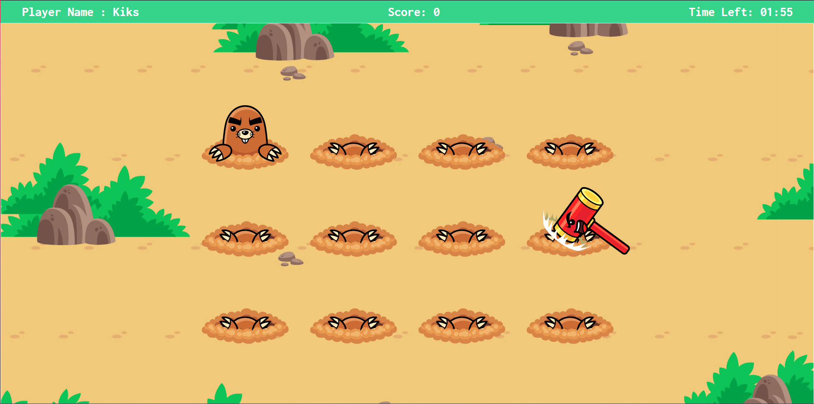
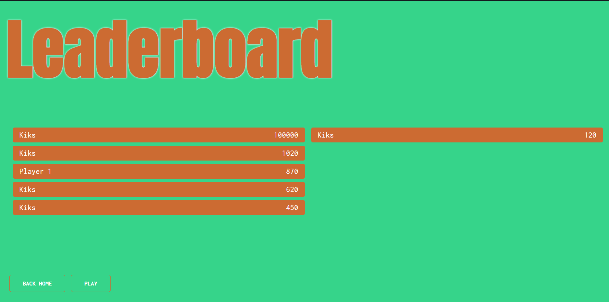

# GAMING1 Technical Test

_The purpose of this technical test is to develop a "Whack-a-mole" game within 3 days using REACT Typescript_

## The game should be playable on a desktop browser only

## Description

This whack-a-mole game is composed with 3 pages :

- The home page
- The game page
- The Leaderboard page

Let's have a quick look at each page.

### Home page



The home page is the first page that the user will see when he opens the game. It contains a button to start the game and a button to see the leaderboard.

### Game page



After a modal is displayed to ask the user to enter his name, the game page is displayed. The user has to click on the moles to score points. The game ends when the timer is over.

As you can see, there a banner at the top of the page that displays the user name, the actual score and the timer.

### Leaderboard page



After the game is over, a modal is displayed to ask the user if he wants to go to the leaderboard page or if he wants to go back to the home page. If the user clicks on the "Go to leaderboard" button, the leaderboard page is displayed. The user can see the top 10 scores of the game.

## How to run the project

### Prerequisites

- Node.js
- NPM

### Installation

1. Clone the repository
2. Go to the frontend folder "whack-a-mole"
3. Run `npm install` to install the dependencies
4. Add a `.env` file at the root of the frontend folder
5. Add the following environment variables in the `.env` file

```
API_URL_ENDPOINT = "http://localhost:5000/leaderboard"
```

6. Run `npm start` to start the project
7. Open another terminal and go to the backend folder "whack-a-mole-server"
8. Run `npm install` to install the dependencies
9. Add a `.env` file at the root of the backend folder
10. Add the following environment variables in the `.env` file

```
PORT=5000
LEADERBOARD_FILE=./server/leaderboard.json
LEADERBOARD_LIMIT=10
```

11. Run `npm start` to start the project
12. Open your browser and go to `http://localhost:3000`
13. Enjoy the game!

## How to run the tests

### Backend -

1. Go to the backend folder "whack-a-mole-server"
2. Run `npm test` to run the tests

### Frontend -

1. Unfortunatlly, I didn't have time to write the tests for the frontend yet

## Future improvements

- Add tests for the frontend
- Add a button to reset the leaderboard
- Add a button to set the game in pause
- Add a button to restart the game

## Author

[Kiks4000](https://github.com/Kiks4000) for [GAMING1](https://www.gaming1.com/)
